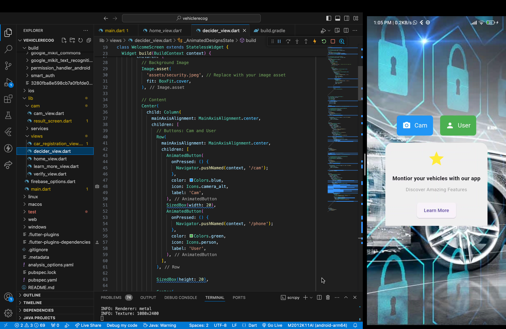
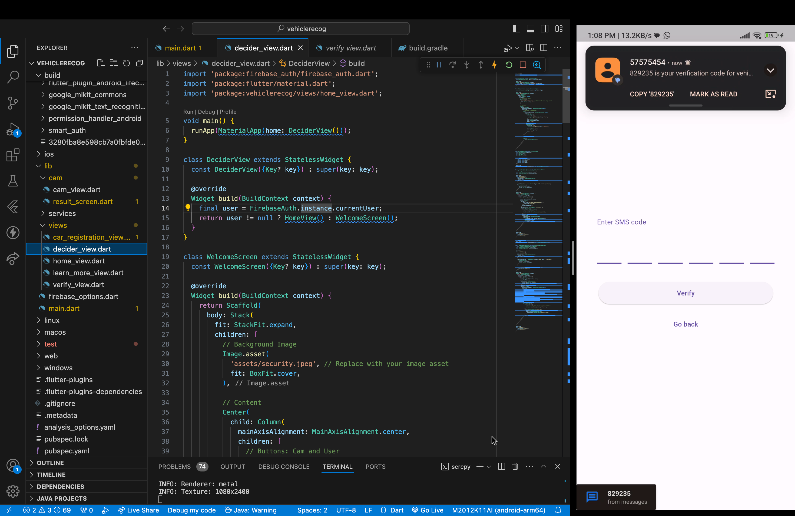
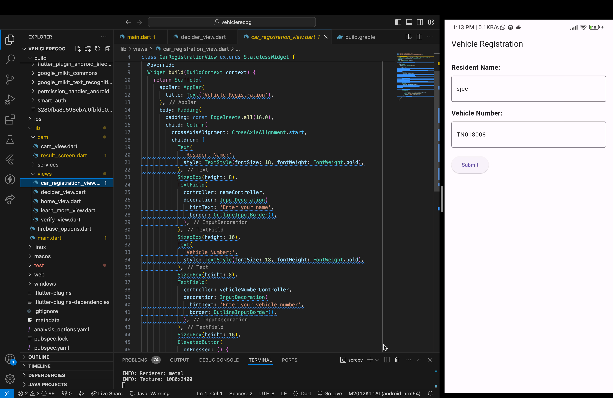
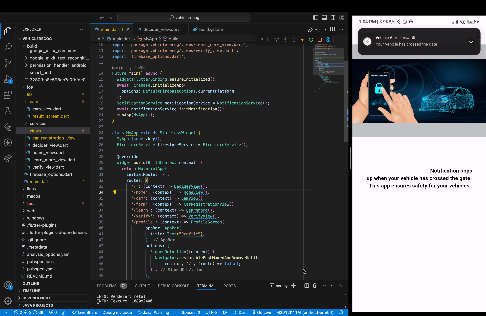

# vehiclerecog

This is Vehicle Recognition app which uses google ML kit for OCR to get text from scanned images and in form we get name and number_plate data from user and store it in database and this when is number plate is scanned using cam button , the corresponding user who has register for that number plate receives a notification that the vehicle has been exited or entered.

## User Interface

##OTP Verification

##Form Validation

##Notication

